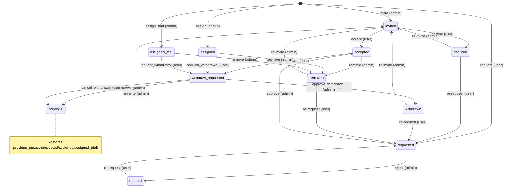
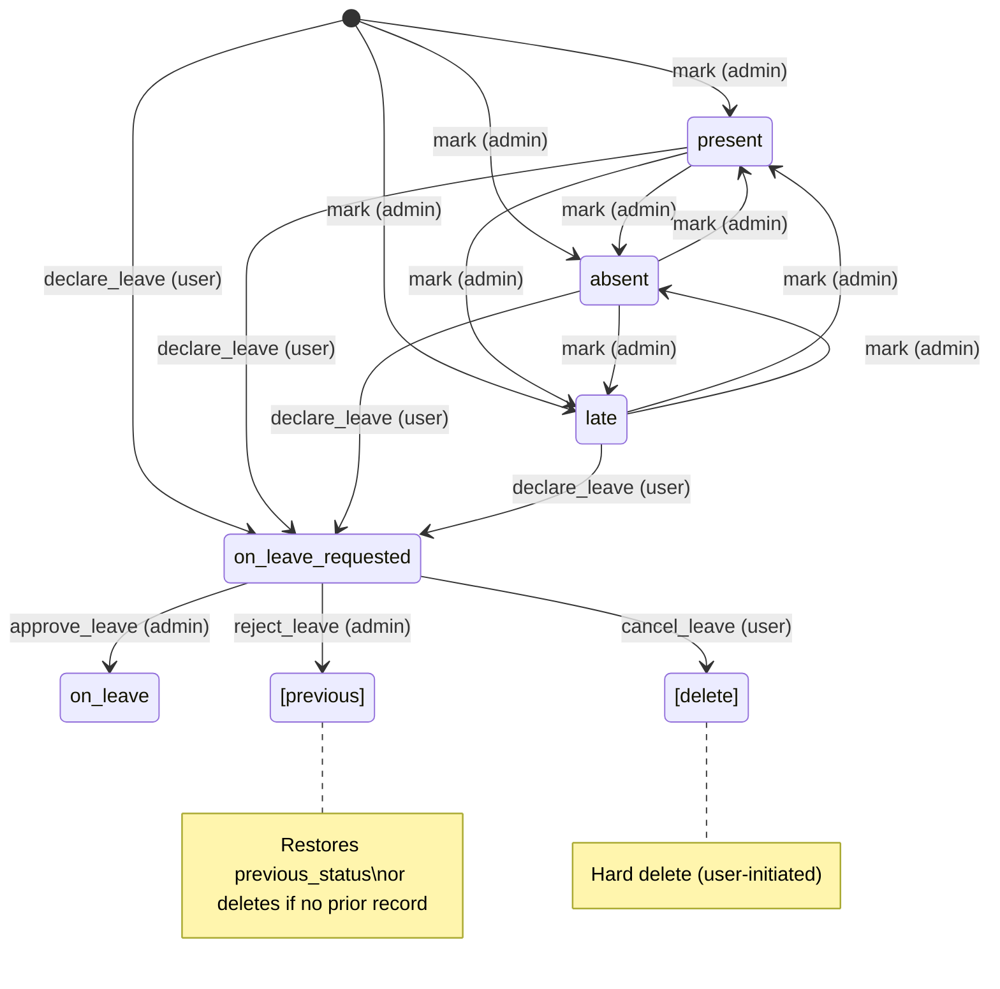
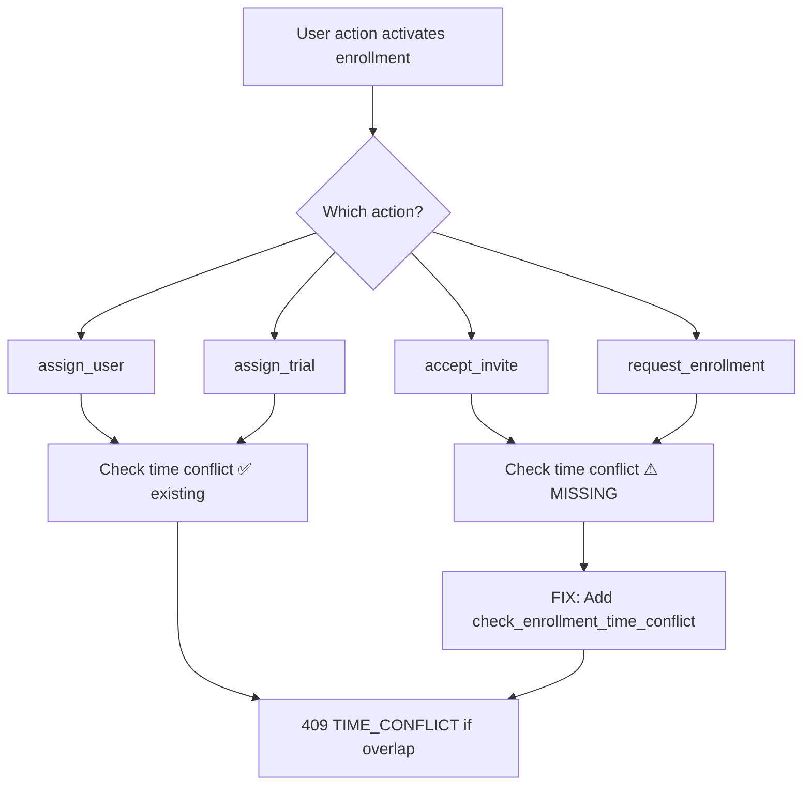
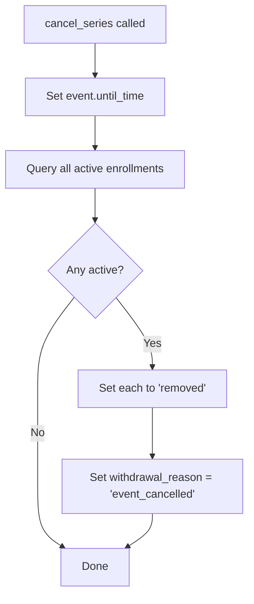
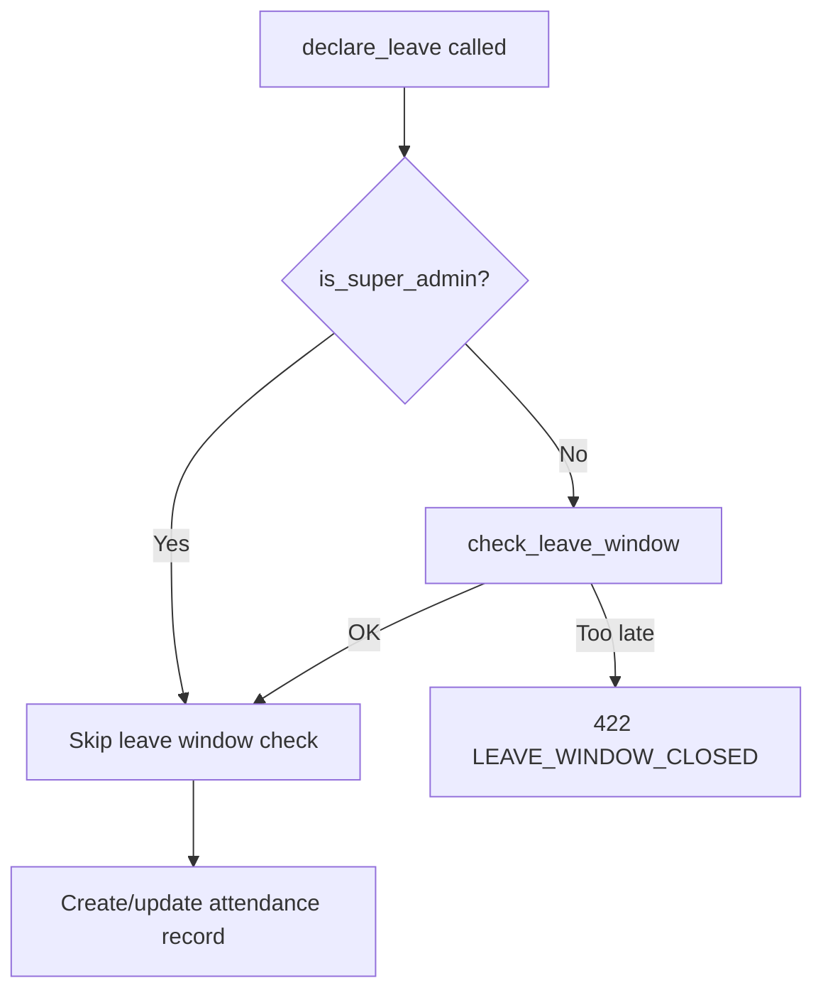

# Issue #97 — Lifecycle Fixes: Enrollment & Attendance Workflows

## Context

PR #124 was closed to address 8 lifecycle review findings before re-opening. This document specifies the enrollment and attendance state machines, error scenarios, and the fixes needed.

---

## 1. Enrollment State Machine



### Status Groups

| Group | Statuses | Meaning |
|-------|----------|---------|
| **Active** | `accepted`, `assigned`, `assigned_trial`, `withdraw_requested` | User participates in event |
| **Terminal** | `declined`, `withdrawn`, `removed`, `rejected` | Enrollment ended; re-entry allowed |
| **Pending** | `invited`, `requested` | Awaiting action |

### Transition Rules & Error Codes

| Action | FROM (required) | TO | Error if wrong FROM |
|--------|----------------|-----|---------------------|
| `accept_invite` | `invited` | `accepted` | 422 ENROLLMENT_TRANSITION |
| `decline_invite` | `invited` | `declined` | 422 ENROLLMENT_TRANSITION |
| `approve_request` | `requested` | `accepted` | 422 ENROLLMENT_TRANSITION |
| `reject_request` | `requested` | `rejected` | 422 ENROLLMENT_TRANSITION |
| `request_withdrawal` | `accepted` / `assigned` / `assigned_trial` | `withdraw_requested` | 422 ENROLLMENT_TRANSITION |
| `approve_withdrawal` | `withdraw_requested` | `withdrawn` | 422 ENROLLMENT_TRANSITION |
| **`reject_withdrawal`** | `withdraw_requested` | **`previous_status`** | 422 ENROLLMENT_TRANSITION |
| **`cancel_withdrawal`** | `withdraw_requested` | **`previous_status`** | 422 ENROLLMENT_TRANSITION |
| `remove_enrollment` | any non-terminal | `removed` | — (admin override, no FROM check) |
| `invite_user` | terminal / none | `invited` | 409 ALREADY_ENROLLED (if active) |
| `request_enrollment` | terminal / none | `requested` | 409 ALREADY_ENROLLED (if active) |
| `assign_user` | terminal / none | `assigned` | 409 ALREADY_ENROLLED (if active) |
| `assign_trial` | terminal / none | `assigned_trial` | 409 ALREADY_ENROLLED (if active) |

---

## 2. Attendance State Machine



### Allowed Values for `mark_attendance`

Only admin-settable statuses via `mark_attendance`:

| Allowed | Rejected (force proper workflow) |
|---------|--------------------------------|
| `present`, `absent`, `late` | `onLeave`, `onLeaveRequested` |

**Error:** 422 `INVALID_ATTENDANCE_STATUS` if `onLeave` or `onLeaveRequested` is passed to `mark_attendance`.

### Leave Workflow Rules

| Action | Precondition | Error |
|--------|-------------|-------|
| `declare_leave` | >= 2h before occurrence | 422 LEAVE_WINDOW_CLOSED |
| `declare_leave` | not already on leave | 409 LEAVE_ALREADY_DECLARED |
| `cancel_leave` | status == `onLeaveRequested` | 422 INVALID_STATE |
| `approve_leave` | status == `onLeaveRequested` | 422 INVALID_STATE |
| `reject_leave` | status == `onLeaveRequested` | 422 INVALID_STATE |

### Leave Cancel vs Reject Behavior

```
cancel_leave (user-initiated):
  └── Hard delete record (no audit needed — user changed their mind)

reject_leave (admin-initiated):
  ├── If previous_status exists → restore to previous_status
  └── If no previous_status (leave was first record) → delete record
```

---

## 3. Time-Conflict Checking



**Fix:** Add `check_enrollment_time_conflict()` call to `accept_invite` and `request_enrollment`.

---

## 4. Event Cancellation → Enrollment Cleanup



**Active statuses affected:** `accepted`, `assigned`, `assigned_trial`, `withdraw_requested`, `invited`, `requested`

---

## 5. Super Admin Bypass for Leave Window



**Fix:** Add `is_super_admin: bool = False` parameter to `declare_leave` and `check_leave_window`, matching the pattern used by `check_edit_window`.

---

## 6. Summary of All 8 Fixes

| # | Finding | Severity | Fix | Files |
|---|---------|----------|-----|-------|
| 1 | `mark_attendance` accepts any string | **High** | Validate against enum; reject `onLeave`/`onLeaveRequested` | `services/attendance.py`, `schemas/attendance.py` |
| 2 | `reject_withdrawal` resets to `accepted` | **Medium** | Restore `previous_status` instead | `services/enrollment.py` |
| 3 | No conflict check on `accept_invite`/`request_enrollment` | **Medium** | Add `check_enrollment_time_conflict` call | `services/enrollment.py` |
| 4 | Leave cancel/reject both hard-delete | **Medium** | `reject_leave`: restore `previous_status` or delete if none | `services/attendance.py` |
| 5 | No super admin bypass for leave window | **Low** | Add `is_super_admin` param to `declare_leave` | `services/attendance.py`, `routers/myevents.py` |
| 6 | `remove_enrollment` no FROM check | **Low** | Intentional admin override (no code change) | — |
| 7 | Re-invitation unrestricted from terminal | **Low** | Intentional re-entry path (no code change) | — |
| 8 | No enrollment cleanup on cancel | **Low** | Auto-transition active enrollments to `removed` | `services/event.py` |

### Items 6 & 7: No Code Change Needed

- **#6 `remove_enrollment`**: Admin override by design — admins can remove any enrollment regardless of current state.
- **#7 Re-invitation from terminal**: Intended re-entry path. Terminal states explicitly allow re-invitation/re-request.

---

## 7. Implementation Order

1. **#1** — Validate attendance status in `mark_attendance` (High, isolated)
2. **#2** — Fix `reject_withdrawal` + `cancel_withdrawal` to restore `previous_status` (Medium, isolated)
3. **#3** — Add conflict check to `accept_invite` + `request_enrollment` (Medium, needs event lookup)
4. **#4** — Fix `reject_leave` to restore previous_status (Medium, isolated)
5. **#5** — Add super admin bypass for leave window (Low, touches router + service)
6. **#8** — Enrollment cleanup on event cancellation (Low, touches event service)

Each fix: write failing test first (TDD red), then implement, then verify green.
