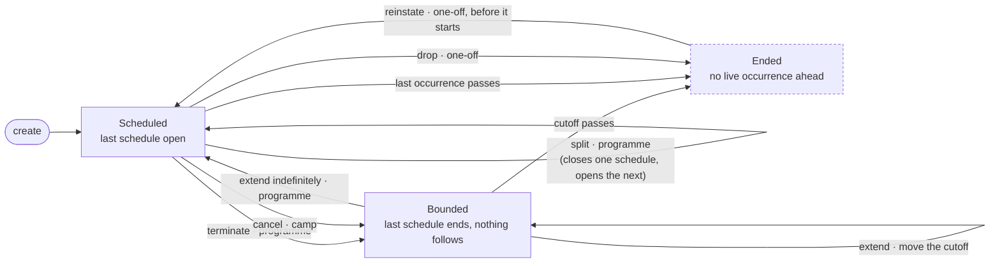
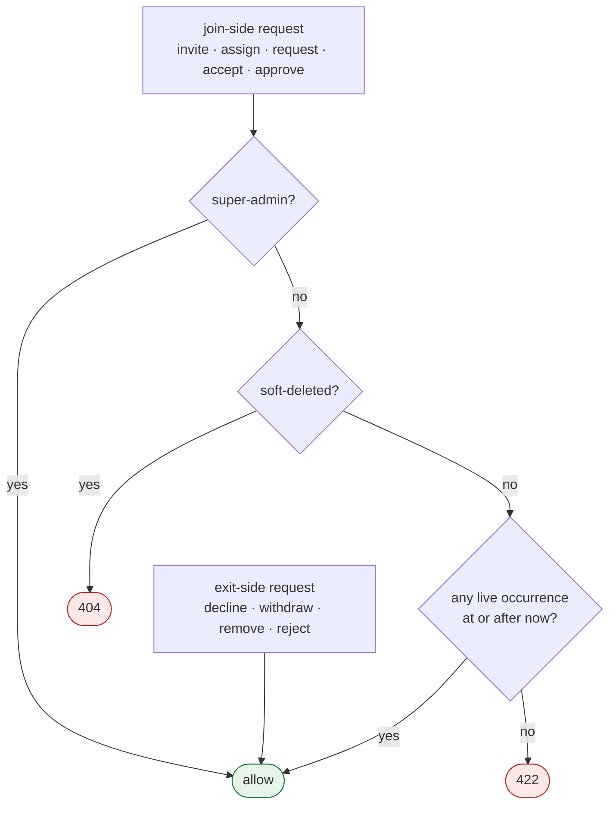
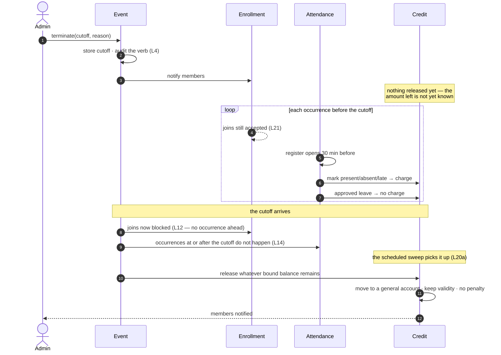

# Event lifecycle — Requirements

**Status: implemented (#384).** Written 2026-09-03 as the first action from
the independent requirement review (`reviews/events_requirements_review_1.md` F1.1,
F2.7, F4.2, F5.2; `reviews/enrollment_requirements_review_1.md` E2, E3;
`reviews/attendance_requirements_review_1.md` A1). `services/lifecycle.py` is the
one implementation of L12 and L14; the changes it implied for the other
documents have been made.

The three questions this draft opened were answered on 2026-09-03 and are
now rules: L20 (credit releases at the cutoff), L21 (bounded events keep
enrollment open, whatever the type).

**Revised the same day for the schedule model.** An event's timetable is a
sequence of schedules ([`event_schedule_model.md`](event_schedule_model.md))
rather than a chain of events, so there is no successor field and no
*superseded* state: a split closes one schedule and opens the next on the
same event, leaving it exactly as it was.

This document owns the lifecycle state of an event. Camps, programmes and
one-offs each describe their own verbs; the enrollment, attendance and
credit documents each ask questions about state. Before this document
existed they answered those questions separately, from the same stored
fields, and disagreed with each other.

Nothing here is type-specific. Where a type restricts a verb, its own
document says so and cites the rule here.

Convention:

- **[✅]** — positive ability is wired and covered by tests.
- **[X]** — prohibition is enforced and covered by tests.
- **[GAP]** — agreed, not yet implemented.

---

## The principle

**A cutoff says when a series stops. It never says why, and it never
means "cancelled".**

Three verbs end an event — drop, cancel, terminate — and they are good
names, because the three intents genuinely differ. The mistake was
expecting a stored field to carry the intent. It cannot: cancelling a
camp and terminating a programme both store a validated occurrence
boundary, by the same mechanism, in the same column. A reader of that
field cannot tell them apart, and every document that tried invented its
own answer.

So the intent lives in the verb, the reason and the audit row. The
behaviour comes from the state, and the state is derived.

---

## Storage

- **L1** An event's lifecycle is carried by exactly two things: the
  **cutoff** — the `effective_until` of its last schedule, held in that
  schedule's rule as `UNTIL` — and the **soft-delete stamp**.
  Per-occurrence cancellation is carried by an occurrence override, not
  here.

  There is no successor field and no chain. A split adds a schedule to the
  same event ([`event_schedule_model.md`](event_schedule_model.md)), so it
  is not a lifecycle transition at all.
- **L2** The cutoff is an instant. An occurrence starting at or after it
  does not happen; one before it does. That is its only meaning.
- **L3** The cutoff is always a validated occurrence boundary, whichever
  verb set it. A cutoff matching no occurrence is a bug, not a state.
- **L4** [✅] The reason a cutoff was set — which verb, whose decision,
  what explanation — is recorded in the audit row, never inferred from
  the field.

---

## Derived states

- **L5** **Scheduled** — the last schedule is open (`effective_until`
  unset). The event runs indefinitely.
- **L6** **Bounded** — the last schedule ends at a cutoff and nothing
  follows it. The event runs normally up to that instant. This is what
  *terminate* and *cancel* both produce, and they are indistinguishable
  here **by design**: both mean "this stops at that instant".

  A split also closes a schedule at a cutoff — and then opens another, so
  the event stays **Scheduled**. That is the whole difference, and it is
  read from whether a schedule follows rather than from a second field.
  An earlier draft carried a third state, *superseded*, for an event that
  had handed over to a successor; under the schedule model no event ever
  hands over, so the state does not exist.
- **L7** **Ended** — no live occurrence remains at or after now. Reached
  by a cutoff passing, by the last occurrence passing, or by every
  remaining occurrence being cancelled individually.
- **L8** **Deleted** — soft-deleted. Orthogonal to the above; a deleted
  event has no lifecycle questions asked of it.

---

## The verbs

- **L9** Each type offers the verbs that make sense for it, and each
  type's own document defines that verb's guards:

  | Verb | Type | Effect on schedules | State after | Occurrences at or after the cutoff |
  |---|---|---|---|---|
  | **terminate** | programme | close the last one at the cutoff | bounded | do not happen |
  | **cancel** | camp | close its only one at the cutoff | bounded | do not happen |
  | **drop** | one-off | none — cancel its single occurrence | ended | none — there was one |
  | **split** | programme | close the last one, open the next at that instant | **scheduled** | happen, under the new schedule |

- **L10** A one-off carries no cutoff (one-off R14). Dropping it cancels
  its single occurrence, which leaves no live occurrence ahead — so it
  reaches **ended** through L7 rather than through a cutoff. This is not
  a special case; it is the general rule applied to a series of one.
- **L11** No behaviour anywhere keys on **which verb** was used. Where a
  consequence differs it differs by **event type**, which is already
  known at every call site. Credit release on termination (programme R10)
  is the only such consequence today, and credit applies to programmes
  alone.

  This is the load-bearing claim of the document. If it holds, the verbs
  are vocabulary and the storage never has to carry intent. If a
  consequence is ever found that depends on the verb rather than the
  type, this rule is what has to change — not L1.

---

## The one question the other documents ask

- **L12** [X] **Join-side flows are blocked when the event has no live
  occurrence at or after the moment of the request.** Exit-side flows
  stay open, so members can leave and admins can clean up. Super-admin
  bypasses.

  This single predicate replaces both "cancelled" and "ended" as
  separately defined tests. It is correct in every case:

  | Case | Live occurrence ahead? | Joins |
  |---|---|---|
  | open-ended programme | always | open |
  | terminated programme, before its cutoff | yes | **open** — programme R5 |
  | terminated programme, after its cutoff | no | blocked |
  | camp cancelled with a future cutoff | yes | **open** — L21 |
  | camp cancelled, cutoff passed | no | blocked |
  | camp whose last occurrence has run | no | blocked |
  | dropped one-off | no | blocked |
  | split programme, either side of a cutoff | yes | open — it never stopped |

- **L13** The predicate needs **existence**, not enumeration. An
  unbounded series trivially has one; a bounded one is a comparison
  against the cutoff. It therefore costs nothing, and does not depend on
  how far ahead occurrences are generated — so it is unaffected by the
  generation-window defect (#370).
- **L14** "Cancelled" is not a state of an event. It is a state of an
  **occurrence**. An occurrence is cancelled if it carries a cancelled
  override, or if its slot falls at or after the cutoff. Nothing reads
  cancellation whole-event.

---

## What the other documents stop saying

Applied; kept as the record of what changed and why.

- **L15** `enrollment_requirements.md` R15 ("ended") and R16
  ("cancelled") are both replaced by L12. R16's storage-shaped test — a
  cutoff set with no continuation — is the reading that closes enrollment
  on a bounded event that is still running, and it does so for **camps as
  well as programmes**.
- **L16** `attendance_requirements.md` R21 keeps its per-occurrence rule
  and cites L14 for it, rather than stating a second definition of
  cancelled.
- **L17** `camps_requirements.md` R5 states cancel's guards and cites L9
  for its effect, which today it does not state at all.
- **L18** `oneoff_requirements.md` R8 keeps recording a drop on the
  occurrence and cites L10 for why that still blocks joins — which today
  it does not, so a dropped one-off accepts new members.
- **L19** `credit_system_requirements.md` gains the termination rule it
  lacks (programme R10 as amended by L20, review CR4). Cancel and drop
  need none: credit applies to programmes only.
- **L19a** `programme_requirements.md` R10 keeps its outcome and loses its
  timing to L20. R10c already says moving a cutoff earlier releases
  nothing on its own; L20 is the same reasoning carried to termination.

---

## Credit and enrollment on a bounded event

- **L20** [GAP] Terminating a programme releases its bound balances **at
  the cutoff**, not at the moment of the call. Until the cutoff the
  programme still runs and still charges (P R5), so the amount actually
  left is unknown until the last occurrence has passed. Releasing at the
  call would move credit out of the account the remaining occurrences are
  paid from.

  This is the same rule as a departure, reached the same way: R29f defers
  settlement to the last covered occurrence and reserves nothing, because no
  held figure could be right. Termination is that case with every member
  leaving at once. **Programme R10 is amended by this** — its outcome
  (released with no penalty, validity window kept) stands; only its
  timing moves.
- **L20a** [GAP] The release is performed by a **scheduled sweep** running
  at the cutoff — not by the terminating call, and not lazily on read.

  Its timing is what makes a cutoff irreversible: once balances are
  released they become general accounts and may be spent elsewhere, so an
  event cannot be extended after its cutoff has passed (programme R6a). The sweep finds bounded
  programmes whose cutoff has passed with balances still bound, and
  releases them.

  It must be **idempotent** — a sweep runs repeatedly and must not release
  twice — which needs a stamp recording that a programme's release has
  been done, rather than inferring it from the balance being zero.

  The same sweep serves R29f, whose deferred departure settlement needs
  exactly this trigger and has never had one (review F3.7). One mechanism,
  two callers: releases due at a cutoff, and departures whose last covered
  occurrence has passed.

  Not lazily on read: a member who never opens the app would never have
  their credit released, and the notification R10 promises would never
  fire. Cadence is a tuning decision, not a requirement — the existing
  scheduler already runs per-tick, hourly and daily sweeps, and hourly
  bounds the delay to an hour.
- **L21** [✅] A bounded event keeps enrollment open until its cutoff,
  **whatever its type**. Occurrences are still going to run, and someone may
  legitimately want to attend them. Programme R5 already said this for
  programmes; it was never a programme-specific allowance, and a camp
  cancelled with a future cutoff behaves identically.

  So the defect recorded in #369 — enrollment closing at the moment of the
  call rather than at the cutoff — is **not programme-specific** and that
  issue needs widening to cover any bounded event.

---

## Concurrent edits

Two people saving the same event must not silently overwrite each other,
and the audit log cannot catch that on its own because the server has no
idea what the client last saw (#292).

- **L22** [✅] Every event carries a `version`, starting at 1, and
  `updatedBy`, the username of whoever last changed it. Both are returned
  in every event response. Every mutation of the event row bumps the
  version and records the actor: update, correction, split, camp cancel
  and undo, terminate, extend, in-place reschedule, delete and restore.

  Changes to a single occurrence — reschedule, cancel and undo-cancel,
  and a one-off's drop and reinstate — do not bump it (#411). They write
  the occurrence, not the event row, so no update, correction or split
  can overwrite them: those touch only the event's own fields, and the
  in-place reschedule refuses while occurrence changes exist unless asked
  to reset them. Two changes to the same occurrence are protected by the
  occurrence's own version (#430).
- **L22a** [✅] Update, correction, split and in-place reschedule
  **require** the version the client last saw in the request body → 422
  when missing. Each of them rewrites fields another editor may be looking
  at; a reschedule moves the window, venue and timetable that update and
  split read (#434). The other mutations take no version; their bump is what
  tells an editor the event moved under them.
- **L22b** [✅] A version the event has moved past is refused → 409
  `STALE_VERSION`. The body carries the current `version`, `updatedAt` and
  `updatedBy`, so the app can say who changed the event and when before
  asking the user to reload. Nothing is written.
- **L22c** Scope is events and their occurrences (L23). Other entities
  get the same protection under their own issues, if at all.
- **L23** [✅] Every occurrence carries a `version`, `updatedAt` and
  `updatedBy`, returned in every occurrence response (#430). An
  occurrence nobody has changed is at version 1 with no author. Every
  change to it — reschedule, cancel and undo-cancel, and a one-off's drop
  and reinstate — bumps the version and records the actor. The event's
  own version is untouched (L22).

  An occurrence has a row only once it has changed, so a stored row is
  never at version 1: the first change writes it at 2. The column is
  required and not nullable.
- **L23a** [X] Those changes **require** the occurrence version the client
  last saw in the request body → 422 when missing. A version the
  occurrence has moved past → 409 `STALE_VERSION`, whose body carries the
  current `version`, `updatedAt` and `updatedBy`. Nothing is written.
  Drop and reinstate take the version of the one-off's single occurrence,
  not the event's.

  Without it, two staff moving the same occurrence overwrote each other:
  the second venue or start time replaced the first, and neither was told.
- **L23b** [✅] A version never goes backwards. Undo-cancel keeps the row
  even when nothing else is overridden, and an in-place reschedule that
  resets overrides clears each row rather than deleting it. A kept row
  with nothing overridden counts as no override, so it does not block an
  in-place reschedule.

## Diagrams

### The verbs and the states

*A split is a self-loop: the event does not change state, because it
never stopped running. Under the previous chain model this was a
transition into a third state, `Superseded`, which no longer exists.*

*Ended is derived, not stored (L7) — nothing writes it. Deleted (L8) is
orthogonal and omitted.*

### Is a join allowed?

The whole of L12, and the only lifecycle question the other documents ask.

*No branch on event type, and none on which verb set the cutoff — that is
L11 and L12 doing their job.*

### Terminating a programme, end to end

Why credit releases at the cutoff and not at the call (L20).

---
## See also

- [`camps_requirements.md`](camps_requirements.md) — cancel (C R5)
- [`programme_requirements.md`](programme_requirements.md) — terminate,
  extend, split (P R1–R9, R23–R24d)
- [`oneoff_requirements.md`](oneoff_requirements.md) — drop and reinstate
  (O R3–R8)
- [`enrollment_requirements.md`](enrollment_requirements.md) — R15, R16,
  replaced by L12
- [`attendance_requirements.md`](attendance_requirements.md) — R21, which
  cites L14
