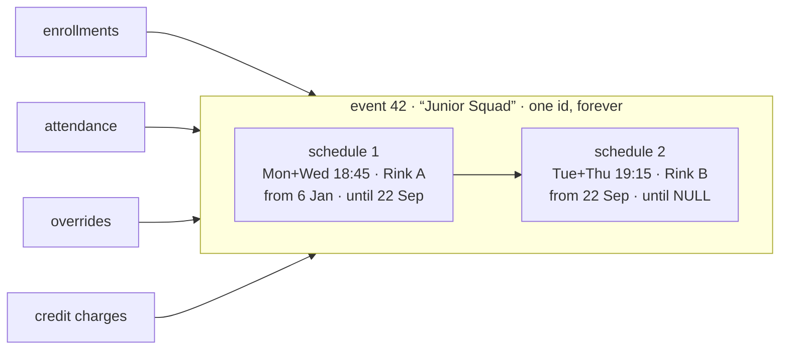
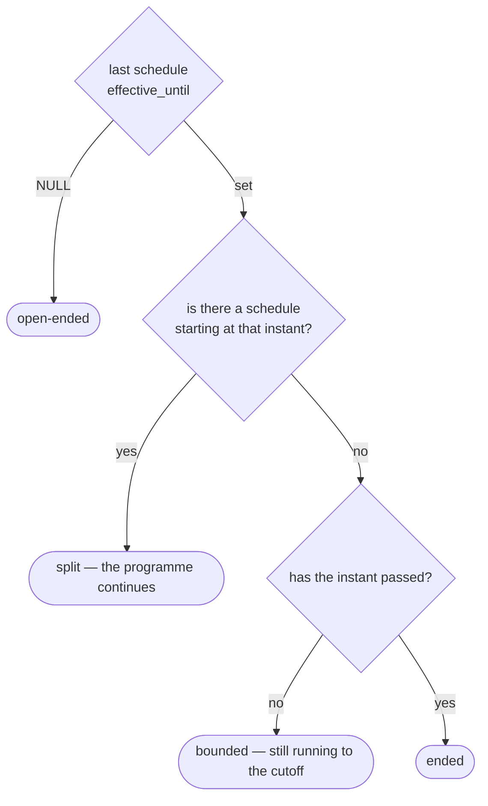

# Event schedule model — design proposal

**Status: agreed 2026-09-03, implemented with #388 and #389** (`event_schedules`
table, `services/schedule.py`, `services/lifecycle.py`, and the
per-type services `programme.py`, `camp.py`, `oneoff.py` behind
`event_types.py`). The requirement documents are written against it. Written 2026-09-03 to answer three questions: how
a schedule child table is sequenced, how termination is marked, and what
it means for camps and one-offs which have only ever needed one schedule.

---

## The problem it solves

`event_id` does two jobs today: *which programme* and *which version of
its schedule*. Splitting a programme forks the version, and every table
keyed on `event_id` — enrollments, attendance, occurrence overrides,
credit charges — silently means the wrong one of the two.

Nine of the twenty-four issues in #384 are that one cause: #364, #367,
#368, #376, #377, #378, #381, plus credit review CR3 and enrollment
review E8. Credit noticed on its own and invented `chain_root_id`;
nothing else did.

The fix is to stop identity moving. An event keeps one id for life. What
changes over time — its schedule — moves to a child table.

---

## The table

```
event_schedules
  id
  event_id          → events.id
  effective_from    instant, inclusive
  effective_until   instant, exclusive; NULL = still running
  start_time        first occurrence window, and the time of day
  end_time
  rrule             programme: weekly + BYDAY.  camp: daily + COUNT.  one-off: NULL
  venue_id          → venues.id
  organizer_name    → users.username  (#386; see below for hard delete)
  sessions          the timetable for one occurrence

event_schedule_coaches                                   (#386)
  schedule_id       → event_schedules.id, CASCADE
  username          → users.username, CASCADE
  position          the order the coaches were listed in
```

A coach assignment belongs to the schedule it was made for, like the
venue and the organizer, so "who coaches this event" reads through the
current schedule and a split can change the coaches from a date. No name
is stored that is not a user; the ordinary delete is the soft delete,
which keeps every reference. The super-admin hard delete takes the
person's coach rows with them, and the events they organized pass to the
super admin performing the delete, so no event is left without an
organizer. The FK's `SET NULL` is only the safety net for a delete that
bypasses the service.

### `effective_until` and the rule's `UNTIL` are the same fact

`effective_until` is carried in the rule as `UNTIL`, and `UNTIL` exists
for nothing else. A caller may **never** set it — not at creation, not on
an update. It is written only by terminate, split and extend.

Boundedness chosen at creation is expressed by `COUNT`, which is a camp
concept: a camp is *n* days long. A programme is created open-ended and
acquires an `UNTIL` only when something ends it.

This removes a whole class of defect. The previous model had a stored
cutoff *and* a rule that could carry its own `UNTIL`, with nothing keeping
them in step — review F1.9, and the reason programme R8 had to say
"clears both". One fact, one place, nothing to diverge.

### Store the cutoff exactly; do not subtract a millisecond

The cutoff **is** the start instant of the first occurrence that does not
run, and `effective_until` holds exactly that, compared with `<`:

```
occurrence belongs to this schedule  iff  effective_from <= t < effective_until
adjacency                            iff  N.effective_until == N+1.effective_from
```

Setting it to one millisecond less would express the same interval as a
closed bound, and adjacency would become
`N.effective_until + 1 == N+1.effective_from`. That epsilon is where
off-by-one bugs live, it has to be remembered at every comparison, and it
makes the stored value not equal to the cutoff the admin actually named.
Half-open intervals need no epsilon — that is what they are for.

**On the event, not the schedule:** `title`, `description`, `visibility`,
`isFeatured`, `galleryUris`, `gender`, the age band. These are the
programme's identity and eligibility, they have exactly one value at a
time, and they are changed by correction (programme R21, R22b). A split
never sets them, which is what removes the correction-versus-split clash
(review F2.1).

**Coaches** move to `event_coaches` keyed on the schedule, not the event —
a split exists partly to change who coaches, and past occurrences must stay
attributed to whoever ran them.

---

## Sequencing

Schedules for one event are **contiguous and non-overlapping**, ordered by
`effective_from`. Each one's `effective_until` equals the next one's
`effective_from`. Exactly one has `effective_until IS NULL`, and only if
the event is still open-ended.

There is no `seq` column and no successor pointer. The order is the
timeline, and adjacency is an invariant the writer maintains — a gap or an
overlap is a bug, checkable by a single query.



Every dependent table points at the **event**, which never changes. That
is the whole point: nothing migrates, ever.

---

## Camps and one-offs

**Exactly one schedule row, always.** It is created with the event and
never joined by a second, because neither type can be split — `/future` is
already gated to programmes.

- **camp** — one row, `rrule` daily with a `COUNT`. Its `effective_until`
  is **derived** by expanding that `COUNT`, not stored independently, so a
  camp's length has one source of truth.

  `COUNT` is the number of days the camp is held (camp R19a): rest days
  (`EXDATE`) are not counted, so a club wanting seven camp days across
  ten composes `COUNT=7` with three `EXDATE`s. Cancelling a camp closes
  `effective_until` earlier.
- **one-off** — one row, `rrule` NULL, `effective_until` = its end time.

They pay one join and gain nothing, which is the honest cost of this
design. What they get in exchange is that every subsystem stops asking
which type it is holding: an occurrence comes from *a schedule*, whatever
produced it.

---

## How each verb is marked

The three questions collapse into one table. `N` is the last schedule.

| Verb | Effect on schedules | Recognised by |
|---|---|---|
| **create** | insert schedule 1, `effective_until` NULL (programme) or set (camp, one-off) | — |
| **split** (programme) | set `N.effective_until = cutoff`; insert `N+1` with `effective_from = cutoff`, `effective_until` NULL | a schedule exists after the cutoff |
| **terminate** (programme) | set `N.effective_until = cutoff`; insert **nothing** | last schedule has `effective_until` set |
| **cancel** (camp) | set `N.effective_until = cutoff` | as terminate — same shape, same mechanism |
| **extend** (programme) | move `N.effective_until` to the new cutoff | — |
| **extend indefinitely** | set `N.effective_until = NULL` | last schedule open again |
| **drop** (one-off) | nothing here — cancel its single occurrence | an occurrence override |

**Termination is the absence of a next schedule, not a flag.** That is the
answer to "how is termination marked": a bounded event is one whose last
schedule ends and is not followed. A split looks identical up to the
cutoff and differs only in what comes after — which is exactly the truth
the current `until_time` + `continued_as_event_id` pair tries to express
with two fields and gets wrong (#369).



This is `event_lifecycle_requirements.md` L5–L7 expressed in storage, and
it needs no `until_time` and no `continued_as_event_id`.

---

## Occurrences

An occurrence comes from exactly one schedule: expand that schedule's
`rrule` from `start_time`, clipped to `[effective_from, effective_until)`.
An event's occurrences are the union over its schedules, and because the
windows are contiguous and non-overlapping, no occurrence is produced
twice and none is lost at a boundary.

The occurrence key stays `(event_id, occurrence_time_utc)`, unchanged — so
overrides, attendance and charges keep the identity they have today. The
schedule that produced an occurrence is derivable from its time; it is not
part of the key.

---

## What disappears

- `events.until_time`, `events.continued_as_event_id`,
  `events.continued_from_event_id`
- `CreditService.chain_root_id` and every chain walk
- Migration of overrides (#367) and attendance (#381) — nothing moves
- Chain-aware coverage (#376), forward propagation (#377), the structural
  half of forward departure (#378), chain-wide correction (#364),
  cancelling a superseded link (#368), charges keyed on a link (CR3),
  the chain gap in enrollment (E8)
- Programme R29a–R29d and the chain vocabulary (review F4.5)

## What it costs

- `continuedAsEventId` / `continuedFromEventId` are **public API**. The
  SDK and the app change.
- Occurrence generation becomes a union over schedules rather than one
  expansion.
- A migration: one schedule row per existing event, then collapse existing
  chains into one event with N schedules, repointing dependent rows to the
  root. Whether any production programme has actually been split needs
  checking first.
- Camps and one-offs carry a one-row child table they do not need.

---

## Per-type service layer

Confirmed alongside this. Today 29 event-type checks sit in the code, and
21 of them are in scheduling — `event.py`, `routers/events.py`,
`occurrence.py`, `rrule.py`, `conflict.py`. Attendance has **none** and
enrollment has one, which is why the table is not split: the polymorphic
parts are already type-agnostic.

`ProgrammeService`, `CampService` and `OneOffService` behind a thin
dispatcher remove those 21 branches, because each service simply does not
contain the other types' cases. Every foreign key still points at one
`events` table, so nothing else moves.

---

## Open points

All three questions this proposal opened are answered.

- **Q1 — production data.** None. Programmes have not been released, so
  no split chain exists anywhere and the migration is a plain backfill:
  one schedule row per existing event. This was the largest risk in the
  proposal and it is not there.
- **Q2 — `effective_until` is exclusive**, holding the cutoff instant
  exactly, with no epsilon. See above.
- **Q3 — a camp's bound is derived** from its `COUNT`, not stored.
